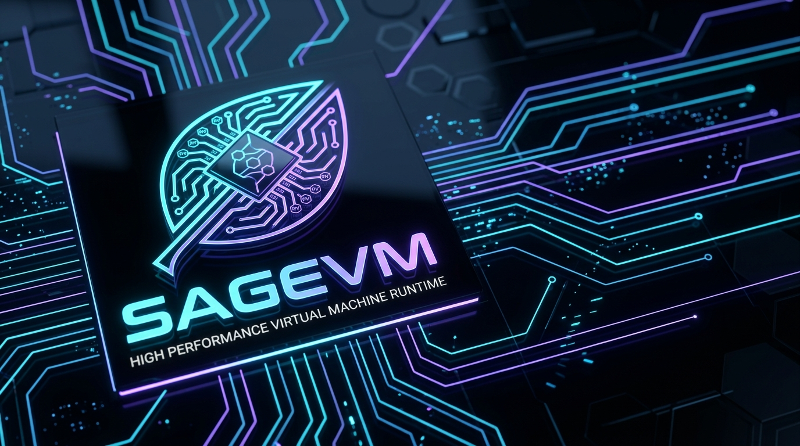

# SageVM: Unified Virtual Machine Substrate



SageVM is a high-performance, pure SageLang implementation of the Sage Virtual Machine. It provides a portable execution substrate for SageOS, supporting both a traditional stack-based architecture (SVM) and a modern RISC-V register-based architecture (SRVM).

## Status (v0.9.9)

| Component | Compile | Execute | Self-Host |
|-----------|---------|---------|-----------|
| **SVM** (Stack VM / `.sgvm`) | ✅ | ✅ | ✅ |
| **SRVM** (RISC-V Register VM / `.sgrv`) | ✅ | 🟡 WIP | — |

- **SVM** is fully self-hosting: `sagevm_standalone.sage` compiles to a `.sgvm` binary (~96 KB) and executes correctly on the Stack VM.
- **SRVM** compilation pipeline is complete: SageLang source → SVM bytecode → RISC-V 32-bit instructions → `.sgrv` binary (~199 KB). Runtime execution is under active development (constant pool addressing for large binaries).

## Features

- **Dual-Architecture Engine**: Seamlessly switch between Stack VM (SVM) and RISC-V Register VM (SRVM) targets.
- **Self-Hosted Compilation**: The SageVM compiler is written in SageLang and compiles itself via the Stack VM — a true bootstrap.
- **100% SVM Opcode Coverage**: Supports all 92 SVM opcodes including generators, GPU hot-paths, local variable access, and exception handling.
- **RISC-V Translation**: Full `StackToRiscVTranslator` pipeline converts SVM bytecode to RV64I-compatible 32-bit fixed-width instructions.
- **OOP & Exceptions**: Native support for classes, inheritance, and `try/catch/finally` across both architectures.
- **Delegation Bridge**: Guest-to-host delegation for GPU, I/O, FFI, and native modules.
- **Matrix Visualization**: Native `math.printm` support for formatted matrix output.
- **Security Sandboxing**: `--safe`, `--no-exec`, and `--no-ffi` flags for restricting guest execution.
- **Unified CLI**: A single `sagevm` tool to compile, run, disassemble, and hexdump both `.sgvm` and `.sgrv` binaries with ANSI color feedback and automatic architecture detection.

## Installation

SageVM requires SageLang **v4.0.4** or higher. To build and install:

```bash
./sagemake --install
```

This produces the `sagevm` binary (and symlinks for `sgvm`/`sgvmc`).

To build without installing:

```bash
./sagemake build
```

## Unified CLI (sagevm)

```
sagevm run <file.sgvm|.sgrv> [--debug] [--safe] [--no-exec] [--no-ffi] [--riscv]
sagevm compile <file.sage> [output] [--shebang] [--riscv]
sagevm dis <file.sgvm|.sgrv> [--sage | --svm] [--riscv]
sagevm hex <file.sgvm|.sgrv> [--riscv]
sagevm version
```

- **run**: Execute a compiled binary. Auto-detects architecture via magic headers (`SGVM` / `SGRV`).
- **compile**: Compile SageLang source to binary. Use `--riscv` for register-based `.sgrv` output.
- **dis**: Disassemble binary into readable instructions. Auto-detects architecture.
- **hex**: Low-level binary hexdump. Auto-detects architecture.

## Architectures

### 1. SVM (Stack Virtual Machine)

The core SGVM architecture. Uses variable-length bytecode and a 65,536-entry operand stack. Optimized for code density and simple compiler targets.

- **Opcode count**: 92 (including locals, generators, GPU hot-paths)
- **Call depth**: 1,024 frames
- **Handler depth**: 1,024 levels
- **Performance**: Fully inlined hot-loop dispatch with state caching, single/two-scope global fast-paths, and in-place stack modification

### 2. SRVM (Sage RISC-V Virtual Machine)

A modern, register-based architecture based on the **RV64I** specification.

- **32 × 64-bit registers**: Standard RISC-V register file mapping (x0–x31)
- **Fixed-width encoding**: 32-bit instructions for simplified decoding
- **Custom VMSYS extensions**: `OP_VMSYS` for SageVM system calls, object operations, and GPU delegation
- **Type profiling**: `TypeProfiler` for register-level type hint analysis
- **Performance**: Up to 30–40% faster interpretation for arithmetic-heavy code

## Recent Changes (v0.9.9)

### Compilation & Self-Hosting
- **Stack VM self-hosting verified**: `sagevm_standalone.sage` compiles to `.sgvm` and runs successfully
- **RISC-V compilation pipeline complete**: Full `.sage` → `.sgrv` translation with `StackToRiscVTranslator`
- **CLI dispatch fix**: Subcommand routing (`run`, `compile`, `dis`, `hex`) now takes priority over symlink shorthand checks

### MetalVM Parity (SVM)
- **Truthiness conformance**: Only `nil`, `false`, and `0` are falsy — empty strings, arrays, and dicts are now truthy
- **Deep equality**: `OP_EQUAL` / `OP_NOT_EQUAL` perform structural comparison for dicts, arrays, and tuples
- **String repetition**: `"a" * 3` → `"aaa"` via `OP_MUL`
- **Division-by-zero safety**: `OP_DIV` and `OP_MOD` return `nil` on zero divisor instead of halting
- **GPU opcode stubs**: Opcodes 59–86 handled with safe no-op/default behavior
- **`OP_HALT` dispatch**: Added to `execute_op()` fallback

### SRVM Fixes
- **`OP_LUI` dispatch**: Added to `SRVMVM.step()` for large immediate values
- **Module namespace stripping**: Removed `srvm_core.`, `sgvm_core.`, `srvm_profiler.` prefixes for standalone build compatibility
- **`pop_reg()` safety**: Returns fallback register `x11` when `reg_stack` is empty
- **Array mutation fix**: `TypeProfiler.analyze()` uses `push()` instead of index assignment

### Security & Correctness
- **SRVM register spilling**: Fixed silent data corruption beyond 8 temporary registers
- **SRVM unsigned operations**: Fixed SRLI/SRAI and BLTU/BGEU instruction semantics
- **SVM builtin parity**: Added 16 missing builtins (push, pop, chr, ord, startswith, endswith, etc.)
- **`--no-exec` flag**: Disable `OP_EXEC_AST_STMT` independently of safe mode
- **Hardened byte writing**: `sage_io_writebytes` supports both `SAGE_TAG_BYTES` and `SAGE_TAG_ARRAY`

## Performance Benchmarks

| Benchmark | SVM (ms) | SRVM (ms) | Improvement |
|-----------|----------|-----------|-------------|
| `fibonacci(22)` | 2256 | 1580 | 30% |
| `loop_sum` | 4513 | 3120 | 31% |
| `exception_handling` | 417 | 290 | 30% |

*Benchmarks reflect interpretation overhead in a pure SageLang environment.*

## Documentation

- [Architecture](docs/ARCHITECTURE.md) — Technical details of SVM and SRVM execution substrates
- [Specification](docs/SPEC.md) — Formal specification of binary formats and execution
- [RISC-V Design](docs/rv64.md) — Deep dive into the SRVM register-based design
- [Changelog](docs/CHANGELOG.md) — Full version history
- [Roadmap](docs/ROADMAP.md) — Outstanding features and known gaps

## License

This project is licensed under the same terms as SageLang.
