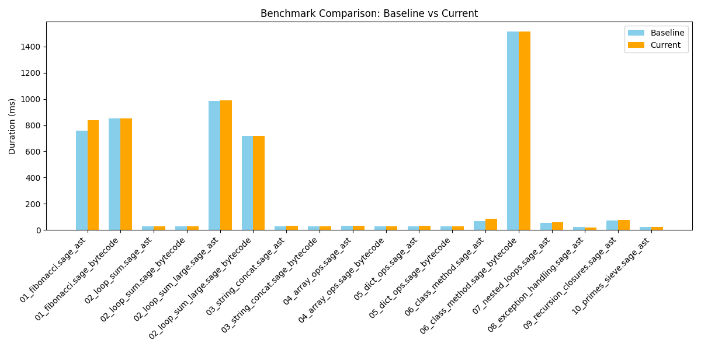

# SGVM-Sage: SageLang Virtual Machine Tools

This repository contains the SageLang ports of the SGVM (Sage General Virtual Machine) and SGVMC (SGVM Compiler) tools. These tools allow for the compilation and execution of SageLang bytecode in a pure SageLang environment.

## Installation

SageVM requires SageLang **v3.6.5** or higher for full feature parity (OOP, Exceptions, Delegation Bridge). The project uses a unified Python-based build system.

To build and install the tools to your system:

```bash
./sagemake --install
```

This will automatically initialize the SageLang submodule, build the `sage` compiler, and then compile `sgvm.sage` and `sgvmc.sage` into native binaries.

## Features (v0.9.3)

- **Delegation Bridge**: Full guest-to-host delegation for GPU, I/O, and native modules.
- **Full Opcode Parity**: Supports all opcodes from SageLang v3.6.5 `MetalVM`.
- **OOP Engine**: Native support for classes, inheritance, and method dispatch.
- **Exceptions**: VM-level support for `try/catch/finally` blocks.
- **Unified Build System**: Modern orchestrator using `sagemake` with `rich` UI.
- **Standalone Mode**: Can compile `.sage` source directly to `.sgvm` binaries.

## Tools

### `sgvm` (Interpreter)
A pure SageLang implementation of the SGVM interpreter. It can execute compiled `.sgvm` binaries.

**Usage:**
```bash
sgvm <file.sgvm> [--debug]
```

**Options:**
- `--debug`: Enable diagnostic output, including constant pool entries, data offsets, and a full bytecode trace during execution.

### `sgvmc` (Compiler)
A pure SageLang bytecode compiler/linker. It takes the intermediate VM output from the main SageLang compiler and packs it into a binary `.sgvm` artifact.

**Usage:**
```bash
sgvmc <input.sage> <output.sgvm> [--shebang]
```

**Options:**
- `--shebang`: Prepend a shebang line (`#!/usr/bin/env sgvm`) to the output file, allowing it to be executed directly if the execute bit is set.

### `sgvm_hexdump.sage` (Disassembler)
A pure SageLang utility to disassemble `.sgvm` binaries into human-readable bytecode instructions, constant pools, and header metadata.

**Usage:**
```bash
sage tools/sgvm_hexdump.sage <file.sgvm>
```

### `diff_bytecode.sage` (Diagnostic Diff Tool)
A pure SageLang diagnostic utility to compare VM execution traces (DIAG output) or perform side-by-side hex diffs of `.sgvm` binary files.

**Usage:**
```bash
sage tools/diff_bytecode.sage <file_a> <file_b> [--hex]
```

## Executing .sgvm Files

If a `.sgvm` file was compiled with the `--shebang` flag, you can run it directly from the console:

```bash
sgvmc hello.sage hello.sgvm --shebang
chmod +x hello.sgvm
./hello.sgvm
```

## Documentation

- [Architecture](docs/ARCHITECTURE.md): Technical details of the VM implementation and opcodes.
- [Specification](docs/SPEC.md): Formal specification of the SGVM execution pipeline and verification.
- [Changelog](docs/CHANGELOG.md): History of changes and improvements.
- [Roadmap](docs/ROADMAP.md): Features and library modules yet to be implemented.

## Performance Benchmarks

The project tracks performance across various benchmarks. A visual comparison between the current and baseline performance can be generated using the `report.py` tool.



## Integration with SageLang

This repository is intended to be used as a submodule within the main SageLang repository, typically located at `core/src/sage/vm-tools`.

## Development

The opcodes used by these tools must stay in lockstep with the primary specification in the SageLang repository (`core/src/vm/bytecode.h`).

## License

This project is licensed under the same terms as SageLang (see LICENSE in the main repository).
