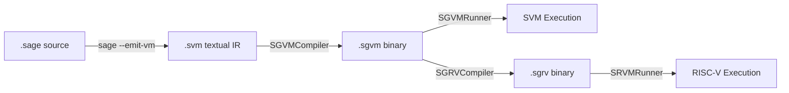

# SageVM — Full Project Analysis

> **Version**: 0.9.4 (VERSION file) / 0.9.7 (README/CLI)  
> **Language**: SageLang (pure, 100%)  
> **Repository**: Night-Traders-Dev/SageVM  
> **Commits**: 146 across single `main` branch  
> **Total SageLang LOC**: 5,676 lines across 30 `.sage` files  

---

## 1. Project Overview

SageVM is a **high-performance, pure SageLang implementation** of a portable virtual machine (SGVM) serving as the execution substrate for SageOS. It features a **dual-architecture engine**:

| Architecture | Type | Encoding | Optimized For |
|---|---|---|---|
| **SVM** (Stack VM) | Stack-based | Variable-length (1–5 bytes) | Code density, simple compiler targets |
| **SRVM** (RISC-V VM) | Register-based (RV64I) | Fixed 32-bit | Arithmetic performance, JIT readiness |

**Key capabilities**: 89 SVM opcodes, full RV64I base ISA, OOP with inheritance, exception handling (`try/catch/finally`), GPU delegation (28 Vulkan/OpenGL opcodes), multi-threading with GIL, native bridge to 9+ host modules, sandboxing, and early JIT infrastructure.

---

## 2. Architecture

### 2.1 Compilation Pipeline



The pipeline uses a **two-stage compilation**:
1. **Host SageLang compiler** (`sage --emit-vm`) generates textual `.svm` intermediate representation
2. **SGVMCompiler** performs a two-pass translation (constant pool building → binary emission) to produce `.sgvm` bytecode
3. Optionally, **SGRVCompiler** translates SVM stack bytecode → RISC-V register bytecode (`.sgrv`)

### 2.2 Binary Formats

| Field | `.sgvm` (Stack) | `.sgrv` (RISC-V) |
|---|---|---|
| Magic | `SGVM` (4 bytes) | `SGRV` (4 bytes) |
| Version | 2 bytes | 2 bytes |
| Constants | BE16 count + typed entries | BE16 count + typed entries |
| Chunks | BE32 count + length-prefixed code | BE32 count + length-prefixed code |
| Instruction width | Variable (1–5 bytes) | Fixed 32-bit |

### 2.3 MetalVM (SVM Engine)

The core interpreter ([sgvm_vm.sage](file:///home/kraken/Devel/SageVM/src/svm/sgvm_vm.sage)) — **907 lines**, the largest file:

- **Operand stack**: Dynamic array, max 65,536 entries
- **Scope chain**: Array of dictionaries (lexical scoping)
- **Call stack**: Array of frame objects `{ip, code, [__is_constructor__, __instance__]}`
- **Exception handlers**: Stack of `{ip, stack_size, call_depth, scopes_len, code}`
- **GIL**: Host mutex (`thread.mutex()`) acquired during `run()`, released on completion
- **Dispatch**: Single `execute_op()` method with `if/elif` chain (no jump table)

### 2.4 SRVM (RISC-V Engine)

The register-based interpreter ([srvm_vm.sage](file:///home/kraken/Devel/SageVM/src/srvm/srvm_vm.sage)) — **364 lines**:

- **32 × 64-bit registers** (x0–x31, x0 hardwired to zero)
- **1000-entry pre-allocated stack** for memory operations
- **Heap**: Dictionary-based global variable storage
- **Hot-path detection**: Counts instruction executions per PC, threshold at 1000 (JIT hook — currently TODO)
- **Custom `OP_VMSYS`** opcode multiplexes VM ops (funct3=000), GPU ops (funct3=001), and object ops (funct3=010)

### 2.5 Stack-to-Register Translation

[srvm_compiler.sage](file:///home/kraken/Devel/SageVM/src/srvm/srvm_compiler.sage) — **509 lines**, implements:

- **Greedy register allocation**: Cycles through x10–x17 (a0–a7)
- **Label map + jump patching**: Pre-scans for catch labels, post-patches branches/jumps
- **Speculative type profiling**: Integrates `TypeProfiler` (currently a stub)
- Translates ~25 SVM opcodes to equivalent RISC-V instruction sequences

---

## 3. Codebase Structure

### 3.1 Source Files by Size

| File | Lines | Role |
|---|---|---|
| [sgvm_vm.sage](file:///home/kraken/Devel/SageVM/src/svm/sgvm_vm.sage) | 907 | SVM interpreter (MetalVM) |
| [srvm_compiler.sage](file:///home/kraken/Devel/SageVM/src/srvm/srvm_compiler.sage) | 509 | SVM→RISC-V translator |
| [sgvm_compiler.sage](file:///home/kraken/Devel/SageVM/src/svm/sgvm_compiler.sage) | 420 | .svm→.sgvm binary compiler |
| [srvm_vm.sage](file:///home/kraken/Devel/SageVM/src/srvm/srvm_vm.sage) | 364 | RISC-V interpreter |
| [sgvm_hexdump_logic.sage](file:///home/kraken/Devel/SageVM/src/svm/sgvm_hexdump_logic.sage) | 305 | SVM binary hexdump |
| [srvm_disassembler_logic.sage](file:///home/kraken/Devel/SageVM/src/srvm/srvm_disassembler_logic.sage) | 301 | RISC-V disassembler |
| [srvm_core.sage](file:///home/kraken/Devel/SageVM/src/srvm/srvm_core.sage) | 297 | RISC-V ISA definitions + encoder |
| [sgvm_disassembler_logic.sage](file:///home/kraken/Devel/SageVM/src/svm/sgvm_disassembler_logic.sage) | 234 | SVM disassembler |
| [sgvm_core.sage](file:///home/kraken/Devel/SageVM/src/svm/sgvm_core.sage) | 232 | SVM opcode definitions + utilities |
| [sgvm_cli.sage](file:///home/kraken/Devel/SageVM/src/sgvm_cli.sage) | 198 | Unified CLI dispatcher |

### 3.2 Directory Layout

```
SageVM/
├── src/
│   ├── sgvm_cli.sage          # CLI entry point
│   ├── svm/                   # Stack VM (7 files, ~2,300 LOC)
│   │   ├── sgvm_core.sage     # Opcode constants + SGVMUtils
│   │   ├── sgvm_vm.sage       # MetalVM interpreter
│   │   ├── sgvm_compiler.sage # .svm→.sgvm compiler
│   │   ├── sgvm_runner.sage   # Binary loader
│   │   ├── sgvm_disassembler_logic.sage
│   │   ├── sgvm_hexdump_logic.sage
│   │   └── net.sage           # Stub (29 bytes)
│   ├── srvm/                  # RISC-V VM (7 files, ~1,500 LOC)
│   │   ├── srvm_core.sage     # RV64I ISA + encoder/decoder
│   │   ├── srvm_vm.sage       # SRVM interpreter
│   │   ├── srvm_compiler.sage # Stack→register translator
│   │   ├── srvm_runner.sage   # SGRV binary loader
│   │   ├── srvm_profiler.sage # Type profiler stub (22 lines)
│   │   ├── srvm_disassembler_logic.sage
│   │   └── srvm_hexdump_logic.sage
│   └── jit/                   # JIT infrastructure (2 files, 80 LOC)
│       ├── jit_emitter.sage   # RISC-V code emitter
│       └── jit_memory.sage    # W^X memory manager (simulated)
├── tools/                     # Diagnostic tools
├── tests/                     # Automated tests (3 .sage + .expected pairs)
├── testing/                   # Legacy tests
├── testsuite/                 # Extended tests + benchmarks
├── docs/                      # ARCHITECTURE, SPEC, ROADMAP, CHANGELOG, rv64.md
├── sagemake                   # Python build orchestrator
├── sagevm.sage                # Main entry point (9 lines)
└── Makefile                   # Orchestrator for sagemake
```

---

## 4. Native Bridge & Builtins

### 4.1 Bridged Host Modules

| Module | Bridge Type | Status |
|---|---|---|
| `math` | Direct host module | ✅ Full |
| `io` | Direct host module | ✅ Full |
| `sys` | Dict wrapper | ✅ Full |
| `net` | Direct host module | ✅ Full |
| `thread` | Direct host module + GIL | ✅ Full |
| `gpu` | Direct host module (28 opcodes) | ✅ Full |
| `ml_native` | Direct host module | ✅ Full |
| `mem` | Builtin string stubs | ⚠️ Partial (depends on host) |
| `ffi` | Builtin string stubs | ⚠️ Partial (sandboxable) |
| `struct` | Builtin string stubs | ⚠️ Partial |
| `gc` | Stub functions | 🔬 Experimental |
| `reflect` | Stub functions | 🔬 Experimental |

### 4.2 Core Builtins

`clock`, `str`, `int`, `tonumber`, `len`, `print`, `range`, `type` — all exposed in guest global scope.

### 4.3 Delegation Mechanism

Native calls use `sys.call()` with explicit arity dispatch (0–8 args). The `__host_mod__` and `__builtin_` tagging system identifies native objects at dispatch time.

---

## 5. Security Model

| Feature | Implementation |
|---|---|
| **Stack overflow protection** | `max_stack_depth = 65,536` |
| **Recursion limit** | `max_call_depth = 1,024` |
| **Handler nesting limit** | `max_handler_depth = 1,024` |
| **Safe mode** | `safe_mode` flag restricts `net`, `sys`, `thread`, `gpu`, `ml_native`, `mem`, `ffi` |
| **FFI toggle** | `ffi_enabled` flag independently controls FFI access |
| **Command injection prevention** | Compiler validates file paths against shell metacharacters |
| **W^X memory** | JIT memory manager enforces write-xor-execute (simulated) |

---

## 6. Testing Infrastructure

| Suite | Location | Tests | Format |
|---|---|---|---|
| Automated | `tests/` | 3 pairs | `.sage` + `.expected` output comparison |
| Legacy | `testing/` | 12 files | Manual verification |
| Extended | `testsuite/` | 6 test files + benchmarks | `.sage` + `.svm` + `.sgvm` |
| Test runner | `tests/run_tests.py` | — | Compiles → runs → diffs output |

---

## 7. Identified Issues

### 7.1 Critical

> [!CAUTION]
> **Version mismatch**: `VERSION` file says `0.9.4`, README says `v0.9.8`, CLI prints `v0.9.7`. Three different versions across the codebase.

> [!WARNING]
> **Duplicate `return true`** in [sgvm_disassembler_logic.sage:142-143](file:///home/kraken/Devel/SageVM/src/svm/sgvm_disassembler_logic.sage#L142-L143) — dead code after the first `return`.

### 7.2 Code Quality

| Issue | Location | Impact |
|---|---|---|
| **`sgvm_core.sage` duplicated** in `src/svm/` and `tools/` | Both copies are 230+ lines | Drift risk — `tools/` copy lacks `OP_GET_LOCAL`/`OP_SET_LOCAL` (opcodes 88-89) |
| **`unpack_double()` duplicated** 3× | `sgvm_core`, `srvm_core`, `tools/sgvm_core` | Identical ~35-line function copied verbatim |
| **Debug prints left in** `srvm_runner.sage` | Lines 13, 16, 19-20, 28, 32 | 6 `print "DEBUG: ..."` statements in production code |
| **Monolithic `execute_op()`** | `sgvm_vm.sage` — single 700-line `if/elif` chain | Hard to maintain; no dispatch table |
| **Register allocation is circular** | `srvm_compiler.sage:31-36` — wraps x10→x17→x10 | Silent register clobbering on deep expressions (>8 values) |
| **`OP_JUMP` missing IP advance** | `sgvm_vm.sage:341` — reads BE16 but doesn't advance `self.ip += 2` | Absolute jump sets IP directly, so this works, but the `OP_LOOP_BACK` on line 352 uses relative arithmetic which does advance — **inconsistent pattern** |
| **`net.sage` is empty stub** | `src/svm/net.sage` — 29 bytes, just `import net` | Likely vestigial — networking done via native bridge |

### 7.3 Missing Features

| Feature | Status |
|---|---|
| Dynamic `.sgvm` module loading | `OP_IMPORT` returns empty dict for unknown modules (TODO comment at line 731) |
| SRVM GPU opcodes | `handle_gpu()` is a stub (line 357-362 of srvm_vm.sage) |
| Type profiler | `TypeProfiler.analyze()` returns empty list (stub) |
| JIT compilation | OSR hook exists but triggers nothing (TODO at srvm_vm.sage:65) |
| Bytecode verifier | Mentioned in SPEC.md but only runtime checks exist |
| `for` loop support in VM | Uses `while` loops internally; `for..in` done at compiler level |
| SRVM function skip logic | Runner executes ALL chunks sequentially (line 76-79), unlike SVM which skips function chunks |

### 7.4 Architectural Concerns

> [!IMPORTANT]
> **SRVM runner skips function chunks incorrectly**: SVM runner starts at `idx = function_count` (skipping function chunks), but SRVM runner iterates ALL chunks starting at 0. This means function chunks get executed as top-level code in RISC-V mode.

> [!NOTE]
> **No register spilling**: The SRVM translator uses only 8 registers (a0-a7) with wraparound. Expressions deeper than 8 stack levels will silently corrupt earlier values. The rv64.md design doc discusses spilling but it's not implemented.

---

## 8. Strengths

1. **Pure SageLang implementation** — the entire VM is self-hosted, demonstrating SageLang's capability as a systems language
2. **Dual architecture** — supporting both stack and register VMs provides flexibility and performance options
3. **Comprehensive opcode coverage** — 89 opcodes including GPU hot-paths, OOP, and exception handling
4. **Well-documented** — extensive ARCHITECTURE.md, rv64.md (755 lines of design rationale), CHANGELOG, ROADMAP
5. **Security-conscious** — DoS limits, sandboxing, W^X enforcement, command injection prevention
6. **Clean binary format** — well-specified header/constant pool/chunk structure with shebang support
7. **Unified CLI** — single `sagevm` binary with auto-detection of architecture via magic headers
8. **Active development** — 146 commits, rapid iteration from v0.8.1 to v0.9.7 in ~2 weeks

---

## 9. Recommendations

### 9.1 Immediate Fixes (Low Effort)

- [ ] Synchronize VERSION file, README, and CLI version string to `0.9.8`
- [ ] Remove duplicate `return true` in disassembler (line 143)
- [ ] Remove debug prints from `srvm_runner.sage`
- [ ] Fix SRVM runner to skip function chunks (add `function_count` offset like SVM runner)
- [ ] Consolidate `sgvm_core.sage` — eliminate the `tools/` duplicate

### 9.2 Code Quality (Medium Effort)

- [ ] Extract `unpack_double()` into a shared utility module
- [ ] Refactor `execute_op()` into sub-methods (arithmetic, control flow, OOP, GPU, etc.)
- [ ] Add register spilling logic when stack depth > 8 in SRVM translator
- [ ] Expand test suite — currently only 3 automated test cases for a 89-opcode VM
- [ ] Add integration tests for SRVM execution path

### 9.3 Strategic (High Effort)

- [ ] Implement the bytecode verifier (pre-execution validation)
- [ ] Complete the type profiler for speculative optimization
- [ ] Implement dynamic `.sgvm` module loading in `OP_IMPORT`
- [ ] Map GPU opcodes in SRVM's `handle_gpu()`
- [ ] Implement JIT compilation (OSR hook → CodeEmitter → ExecutableMemoryManager)

---

## 10. Metrics Summary

| Metric | Value |
|---|---|
| Total `.sage` LOC | 5,676 |
| Total commits | 146 |
| Source files | 30 `.sage` files |
| Documentation | 5 markdown docs (~60 KB) + 755-line design doc |
| SVM opcodes | 89 (0–87, 255) |
| RISC-V opcodes | 11 major groups + 13 VM extensions + 28 GPU + 14 object ops |
| Test cases | 3 automated + 12 legacy + 6 extended |
| Native bridge modules | 12 |
| Benchmark suites | 1 (with SVM vs SRVM comparison) |
| Build dependencies | SageLang v3.7.7+, Python 3, `rich` library |
