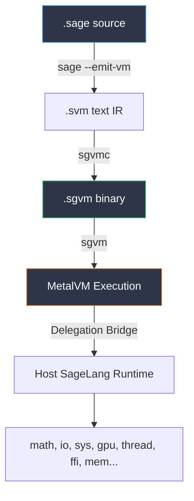

# SageVM Codebase Analysis

**Version**: 0.9.3 · **Total LOC**: ~1,300 (SageLang core) + 750 (tooling/tests) · **Language**: SageLang (self-hosted), Python (build/tools)

---

## Architecture Overview



SageVM is a **self-hosted bytecode VM** — the entire toolchain (compiler + interpreter) is written in SageLang and runs on top of the SageLang host. The execution pipeline is:

1. **SageLang compiler** (`sage --emit-vm`) transforms `.sage` → `.svm` text IR
2. **SGVMC** ([sgvmc.sage](file:///home/kraken/Devel/SageVM/sgvmc.sage)) packs `.svm` → `.sgvm` binary
3. **SGVM** ([sgvm.sage](file:///home/kraken/Devel/SageVM/sgvm.sage)) loads and executes `.sgvm` via `MetalVM`

---

## Component Breakdown

### 1. Core Definitions — [sgvm_core.sage](file:///home/kraken/Devel/SageVM/src/sgvm_core.sage) (229 LOC)

| Section | Lines | Purpose |
|---------|-------|---------|
| Opcode constants | 1–92 | 59 general + 28 GPU + HALT = **88 opcodes** total |
| `SGVMUtils` class | 94–229 | Utility belt: hex parsing, string ops, IEEE 754 double pack/unpack |

> [!IMPORTANT]
> The `SGVMUtils` class is **manually implementing IEEE 754** double-precision float encoding/decoding in pure SageLang. This is the most fragile code in the repo — any precision drift in the mantissa extraction loop (lines 88–98 of `write_double`, lines 192–228 of `unpack_double`) will corrupt numerical constants silently.

**Key observations:**
- `my_substr` (line 149) takes `(s, start, length)` but some callers use it as `(s, start, end)` — this is a latent semantic mismatch risk
- `hex_to_byte` loops through all 16 chars even after finding a match — no early exit
- No bounds checking on `read_be16` / `read_be32` — will crash on truncated input

---

### 2. Compiler — [sgvm_compiler.sage](file:///home/kraken/Devel/SageVM/src/sgvm_compiler.sage) (323 LOC)

The compiler reads `.svm` text IR (emitted by the SageLang frontend) and serializes it into the SGVM binary format.

**Two-pass architecture:**
1. **Pass 1** (lines 155–244): Scans all chunks/functions, builds a deduplicated global constant pool and local→global index maps
2. **Pass 2** (lines 268–319): Re-scans, emitting binary bytecode with remapped constant indices

**Binary format** (from [SPEC.md](file:///home/kraken/Devel/SageVM/docs/SPEC.md)):
```
[Optional shebang] [SGVM magic 4B] [Version 2B] [FuncCount 2B] [ConstCount 2B] [Constants...] [ChunkCount 4B] [Chunks...]
```

> [!WARNING]
> **Argument remapping logic is complex and fragile.** The compiler maintains two parallel maps per chunk:
> - `local_to_global` — remaps parameter names to `__argN` synthetic names
> - `local_to_global_raw` — preserves original string indices
>
> Which map is used depends on the opcode (line 283–318). A single wrong opcode assignment here silently corrupts all name resolution for that instruction type.

**Other findings:**
- The `compile()` method is 183 lines — a single monolithic function doing parsing, constant collection, and binary emission
- `write_double` has a special-case for `v == nil` (line 55) that returns silently — could mask bugs upstream
- No error recovery: if the `.svm` format is malformed, behavior is undefined

---

### 3. VM Interpreter — [sgvm_vm.sage](file:///home/kraken/Devel/SageVM/src/sgvm_vm.sage) (664 LOC)

The heart of the system. A single `MetalVM` class with a classic fetch-decode-execute loop.

**Architecture:**
- **Stack machine** with dynamic typing
- **Scope chain** (array of dicts) for variable resolution
- **Call stack** for function frames (IP + code restoration)
- **Handler stack** for exception try/catch
- **GIL** via host `thread.mutex()` for thread safety

#### Opcode Coverage Matrix

| Category | Opcodes | Status |
|----------|---------|--------|
| Stack ops | CONSTANT, NIL, TRUE, FALSE, POP, DUP | ✅ |
| Variables | GET/SET/DEFINE_GLOBAL | ✅ |
| Arithmetic | ADD–MOD, NEGATE | ✅ |
| Comparison | EQUAL–LESS_EQUAL | ✅ |
| Bitwise | AND, OR, XOR, NOT, SHIFT_L/R | ✅ |
| Logic | NOT, TRUTHY | ✅ |
| Control flow | JUMP, JUMP_IF_FALSE, LOOP_BACK | ✅ |
| Data structures | ARRAY, TUPLE, DICT, GET/SET_INDEX, SLICE, ARRAY_LEN | ✅ |
| Functions | DEFINE_FUNCTION, LOAD_FUNCTION, CALL, RETURN | ✅ |
| OOP | CLASS, METHOD, INHERIT, GET/SET_PROPERTY, CALL_METHOD | ✅ |
| Exceptions | SETUP_TRY, END_TRY, RAISE | ✅ |
| Modules | IMPORT | ✅ |
| I/O | PRINT | ✅ |
| GPU | 28 opcodes (59–86) | ✅ Delegated to host |
| Misc | EXEC_AST_STMT, BREAK, CONTINUE | ⚠️ Stubs/warnings |
| Halt | HALT | ✅ |

#### Critical Code Quality Findings

> [!CAUTION]
> **Bug: `OP_BREAK` and `OP_CONTINUE` are not implemented.** Opcodes 49 and 50 are defined in `sgvm_core.sage` and imported in the VM, but there is **no handler** for them in `run_step()`. If bytecode containing a `break` or `continue` is executed, it will fall through to `"Unknown OP"` and halt.

> [!WARNING]
> **Bug: `OP_JUMP` does not advance IP past operand.** At line 207, `OP_JUMP` sets `self.ip = ut.read_be16(self.code, self.ip)` — this is correct for absolute jumps. But `OP_JUMP_IF_FALSE` (line 209–212) reads the target AND advances `self.ip += 2` before potentially branching. The asymmetry suggests `OP_JUMP` is treated as an absolute jump (no IP advance needed) while `OP_JUMP_IF_FALSE` needs the advance for fall-through. This is **intentionally asymmetric** but worth documenting explicitly.

> [!WARNING]
> **Delegation Bridge arity limit.** Host function/method calls are dispatched via cascaded `if/elif` chains limited to:
> - `OP_CALL` (native): max **5 args** (line 352–358)
> - `OP_CALL_METHOD` (module): max **3 args** (line 414–418)
> - `OP_CALL_METHOD` (primitive): max **2 args** (line 428–431)
>
> Any call exceeding these limits prints an error and pushes nothing — **corrupting the stack** for subsequent operations.

**Variable resolution** (OP_GET_GLOBAL, lines 94–111) walks the scope chain top-down. This is O(n) per scope depth per variable access — fine for typical depth but could be a bottleneck in deeply nested code.

---

### 4. Binary Loader — [sgvm.sage](file:///home/kraken/Devel/SageVM/sgvm.sage) (89 LOC)

Clean, straightforward binary parser. Notable design:
- Skips optional shebang (`#!`) prefix (lines 26–30)
- Validates `SGVM` magic bytes
- Deserializes constant pool (numbers via `unpack_double`, strings via byte-by-byte chr)
- Loads chunks sequentially
- **Executes only non-function chunks** (line 83: starts from `idx = function_count`)

> [!NOTE]
> The loader distinguishes function chunks from top-level code chunks by using the `function_count` header field as a skip offset. Functions at indices 0..N-1 are only invoked via `OP_CALL`. Chunks at indices N..end are executed sequentially as "main" code.

---

### 5. Build System — [sagemake](file:///home/kraken/Devel/SageVM/sagemake) (165 LOC)

Python 3 build orchestrator using `rich` for UI. Pipeline:
1. Update SageLang submodule
2. Build SageLang compiler (if needed)
3. Compile `sgvm.sage` → `sgvm` native binary
4. Compile `sgvmc.sage` → `sgvmc` native binary
5. Optional install to `/usr/local/bin`

> [!NOTE]
> `sagemake` hardcodes `-Wno-overlength-strings` in CFLAGS (line 101) — this is a known workaround for the SageLang compiler's C backend generating very long string literals for embedded constant pools.

---

### 6. Diagnostic Tools — [tools/](file:///home/kraken/Devel/SageVM/tools)

| Tool | LOC | Purpose |
|------|-----|---------|
| [sgvm_hexdump.sage](file:///home/kraken/Devel/SageVM/tools/sgvm_hexdump.sage) | 343 | Disassemble `.sgvm` binaries into human-readable instruction listings |
| [diff_bytecode.sage](file:///home/kraken/Devel/SageVM/tools/diff_bytecode.sage) | 245 | Compare DIAG traces or hex-diff two `.sgvm` files |

These are well-documented and critical for debugging compiler/VM mismatches.

---

## Testing Coverage

| Test File | What it covers | LOC |
|-----------|---------------|-----|
| [test_arithmetic.sage](file:///home/kraken/Devel/SageVM/testsuite/test_arithmetic.sage) | Add, mul, div, mod | 15 |
| [test_control_flow.sage](file:///home/kraken/Devel/SageVM/testsuite/test_control_flow.sage) | if/elif/else, while | 27 |
| [test_functions.sage](file:///home/kraken/Devel/SageVM/testsuite/test_functions.sage) | Recursion (fib, factorial) | 23 |
| [test_class.sage](file:///home/kraken/Devel/SageVM/testsuite/test_class.sage) | Class, init, methods | 23 |

> [!CAUTION]
> **Major gap: No automated test runner.** Tests exist but there's no harness to compile them, run them through the VM, and verify output. Each must be run manually. There are also **zero tests** for:
> - Exception handling (try/catch/raise)
> - Imports / module system
> - Array/dict/slice operations
> - Bitwise operations
> - Native bridge calls (math, io, thread)
> - GPU delegation
> - Edge cases (stack overflow, constant pool limits, malformed bytecode)

---

## Prioritized Findings

### 🔴 Bugs to Fix

1. **`OP_BREAK` / `OP_CONTINUE` unimplemented** — Any loop using `break`/`continue` will crash the VM
2. **Stack corruption on high-arity native calls** — Exceeding the delegation bridge arity limit pushes nothing but still consumed arguments
3. **No bounds checking in loader/core** — Truncated `.sgvm` files will cause index-out-of-bounds crashes

### 🟡 Technical Debt

4. **Monolithic `run_step()`** — 600-line elif chain. Hard to maintain, debug, or extend
5. **Monolithic `compile()`** — 183-line function doing three concerns (parsing, constant management, emission)
6. **Hardcoded integer opcodes in VM** — Lines like `elif op == 37` instead of using the named constants (`OP_CALL`) that are already imported but unused
7. **`my_substr` semantic ambiguity** — Third parameter means "length" but easy to confuse with "end index"

### 🟢 Missing Features (per ROADMAP)

8. **GPU hot-paths** — Delegated to host but no standalone implementation
9. **Networking** — `net.sage` is an empty shim
10. **JIT/AOT** — Research/future
11. **Bytecode verification** — Mentioned in SPEC.md as mandatory, but not implemented in the loader

---

## Repository Structure Summary

```
SageVM/
├── sgvm.sage              # Binary loader + entry point (89 LOC)
├── sgvmc.sage             # Compiler CLI driver (31 LOC)
├── src/
│   ├── sgvm_core.sage     # Opcodes + Utils (229 LOC)
│   ├── sgvm_compiler.sage # .svm → .sgvm compiler (323 LOC)
│   ├── sgvm_vm.sage       # MetalVM interpreter (664 LOC)
│   └── net.sage           # Empty shim (2 LOC)
├── sagemake               # Python build orchestrator (165 LOC)
├── Makefile               # Thin wrapper around sagemake
├── tools/                 # Diagnostic: hexdump, diff (341 LOC)
├── testsuite/             # 4 basic tests + benchmarks
├── testing/               # 2 trivial test files
└── docs/                  # ARCHITECTURE, SPEC, CHANGELOG, ROADMAP
```
